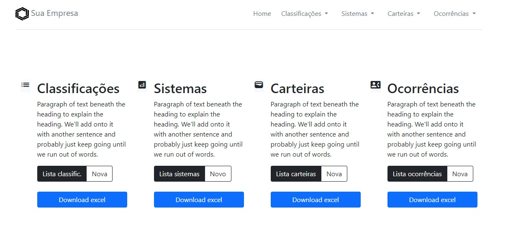
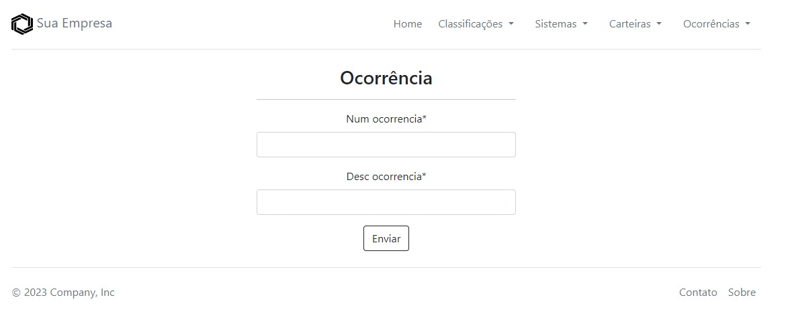
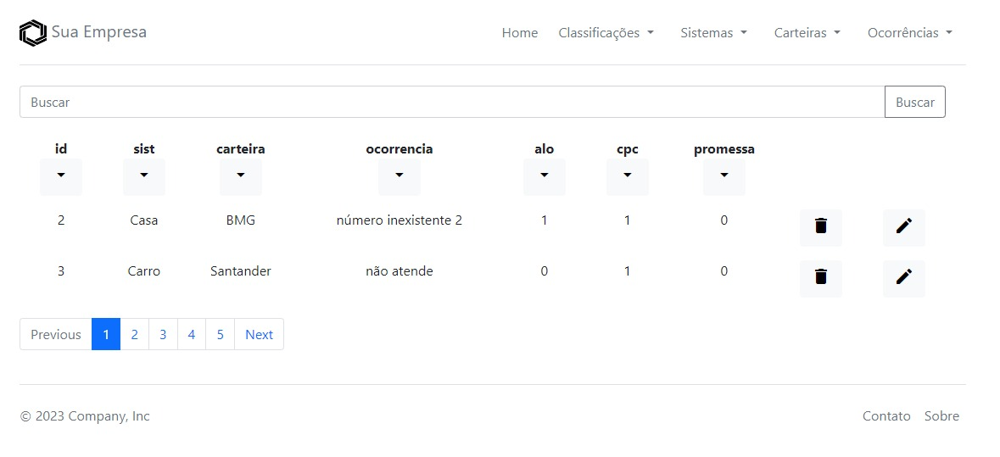

# Registro de Ocorrências 📊
Essa aplicação foi desenvolvida com o objetivo classificar registros de ocorrências realizadas no banco de dados de um call center para facilitar relatórios gerenciais.

Ela foi desenvolvida em Django tendo dois apps com funções distintas dentro dela. Um dos apps é uma API que foi desenvolvida com Django Rest Framework e contém todos os endpoints responsáveis pelo CRUD completo de todas as entidades e por trazer os dados em formato JSON. Já o segundo app é chamado ‘relatório’ e é responsável por interagir com o fron-end, receber as requisições do usuário e enviar essas requisições a API.  A interação com a API se dá apenas por meio do front-end. 

A arquitetura da aplicação segue muito semelhante a arquitetura do Django, seguindo o padrão MVC (Model-View-Controller). Além disso, foram acrescentados alguns arquivos complementares como o ‘excel.py’ que ficou responsável por fazer o download de dos dados de cada entidade e ‘forms.py’ para geração de formulários. 

### Pré-requisitos para rodar a aplicação:

Instalar Python e Git.

### Tecnologias utilizadas 📲:
* Python 3.10.2
* Django 4.1
* Django-Rest-Framework 3.14.0
* Django-crispy-forms 2.0
* Sqlite 3.37.2
* Bootstrap 5
* Git

### Como instalar a aplicação localmente 💻:

Clona o reposiório:

```
git clone https://github.com/CamilaFreitass/registro_ocorrencias.git
```
Instala os pré-requisitos do Python:
```
pip install requirements.txt 
```
Sobe o servidor:
```
python manage.py runserver 
```
Acessar a aplicação pelo link gerado:
```
http://127.0.0.1:8000/
```

### Funcionalidades 🔀:
* CRUD para todas as entidades(tabelas)
* Exportação de excel individual para cada entidade(tabela)
* Paginação para facilitar a visualização dos registros
* Campo de busca para agilizar a procura
* Ordenação para ajudar na organização da listagem dos dados
* Mensagens de alerta para comunicar ao usuário (sucesso, erro, falha ou especificação) 

### Entidades/Tabelas:
* Carteira
* Discador Ocorrência (Classificação das ocorrências)
* Ocorrências 
* Sistema 

### Página Inicial da aplicação: 



### Página com resultado da listagem de classificações:



### Página do formulário de ocorrências:



